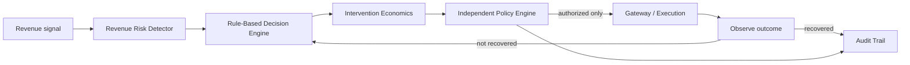

# KRAFT AI

> **Bounded AI agents for revenue recovery.**

Kraft AI is a runnable Razorpay AI Buildathon **Track 03 — AI Revenue Recovery** MVP. It detects revenue at risk, compares recovery interventions by **expected net recovery**, sends the recommendation through deterministic guardrails, executes only authorized work, observes the synthetic outcome, replans when allowed, and preserves an audit trail.

> **SYNTHETIC BENCHMARK — NOT PRODUCTION DATA.** All customers, money, outcomes, and evaluation results are generated for demonstration.

## Problem

A failed payment is not always a retry problem. A subscription decline, abandoned checkout, and overdue B2B invoice each need a different economic intervention. Kraft AI optimizes *which intervention* to make—not merely retry probability—while retaining strict consent, limits, stopping rules, and auditability.

## Track 03 alignment

- Explicit revenue-risk detector for failed subscriptions, checkout abandonment, and B2B receivables.
- Economics-aware action planning across retry, payment link, Hinglish voice, promise-to-pay, human escalation, defer, and stop.
- Deterministic compliant escalation, contact window, retry/intervention stopping rules, consent checks, and auditable transitions.
- Reproducible batch evaluation against a retry-first baseline using the same 500 synthetic cases.

## Solution and architecture



**The model recommends. The policy engine authorizes. The execution layer acts. The audit trail remembers.** The default decision engine is deterministic and explainable; no paid LLM is required.

## Revenue risk detection and intervention economics

`RevenueRiskDetector` separately calculates amount at risk, score, urgency, scenario, segment, and prior attempts. The planner evaluates each action:

`expected gross recovery = amount × recovery probability`  
`expected net recovery = expected gross recovery − intervention cost`

Synthetic configurable costs are ₹0.50 retry, ₹0.30 link, ₹2.50 voice, ₹0.40 promise-to-pay, ₹80 human escalation, ₹0.05 defer, and ₹0 stop. The dashboard shows every option and highlights the economically preferred action.

## Policy engine and adaptive recovery

`PolicyEngine` is final authority, not the planner. It stops opted-out customers, escalates disputes and exhausted intervention budgets, defers outside 08:00–20:00, forbids retries after two attempts, and refuses voice without explicit opt-in. After a non-recovery, the orchestrator records observation, moves to `replan`, excludes the prior action, and evaluates an allowed alternative. Terminal states are recovered, stopped, escalated, and deferred.

## Hinglish voice and Razorpay adapter

The voice UI demonstrates a consent-bound Hinglish recovery call. The server-only `SarvamService` fails gracefully if `SARVAM_API_KEY` is missing; it never leaks credentials. It is designed for Saaras v3 (`codemix`, `hi-IN`) transcription and Bulbul v3 (`shubh`, `hi-IN`, WAV/24kHz) speech. `RazorpayGateway` is credential-gated using `RAZORPAY_KEY_ID`/`RAZORPAY_KEY_SECRET`; without legitimate Test Mode credentials the UI clearly uses **Synthetic / Mock Payment Environment**. No mock call is represented as a Razorpay transaction.

## Synthetic benchmark and methodology

`data/generate_cases.py` generates 500 seeded cross-scenario synthetic cases. `evaluation.py` uses the exact same case set for a retry-first baseline and Kraft AI’s bounded multi-channel planner. It reports revenue at risk, recoveries/rates/uplift, costs/net recovery, cost per success, policy violations, unsafe actions avoided, terminal counts, interventions, recovery per intervention, and efficiency. Results are reproducible with a seed.

## Setup and running locally

```bash
python -m venv .venv
source .venv/bin/activate
pip install -r backend/requirements.txt
cp .env.example .env # optional: add legitimate server-side credentials
PYTHONPATH=. python data/generate_cases.py
PYTHONPATH=. python evaluation.py
PYTHONPATH=. uvicorn backend.app.api.main:app --reload
```

Open [http://127.0.0.1:8000](http://127.0.0.1:8000). Do not commit `.env`.

## API documentation

- `GET /health`, `GET /`, `GET /v1/evaluation`
- `GET /v1/cases`, `GET /v1/cases/{case_id}`, `GET /v1/cases/{case_id}/decision`
- `POST /v1/cases/{case_id}/execute`, `POST /v1/recover`, `GET /v1/audit/{case_id}`
- `POST /v1/voice/transcribe`, `POST /v1/voice/speak` (credential-gated)

Interactive OpenAPI documentation is at `/docs`.

## Testing

```bash
PYTHONPATH=. pytest -q
```

Tests cover opt-out stopping, dispute escalation, contact hours, retry/intervention limits, voice consent, economic choice, policy overrides, audit events, mock execution, recovery transitions, and reproducible evaluation.

## Five-minute demo

1. Open the dashboard and frame the synthetic revenue-at-risk benchmark.
2. Open a failed subscription case and inspect the explicit risk signal and root cause.
3. Compare action economics, then show that policy independently approves or overrides it.
4. Execute the mock action; show recovery or the bounded replan path and audit trail.
5. Demonstrate the Hinglish voice intervention, consent status, and benchmark comparison.
6. Close with: *The model recommends. The policy engine authorizes. The execution layer acts. The audit trail remembers.*

## Limitations and future improvements

This is a local synthetic MVP: outcomes are modeled, live Sarvam adapters are intentionally credential-gated, and production Razorpay actions require a reviewed implementation and legitimate Test Mode credentials. Next steps include durable event storage, webhook-backed observations, consent ledger integration, queue workers, real provider adapters, A/B experimentation, and human-workflow SLAs.
